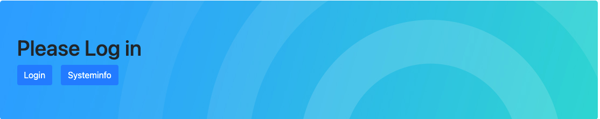
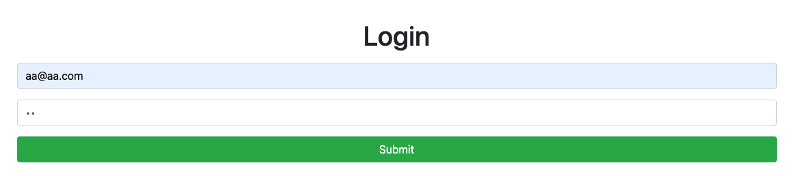
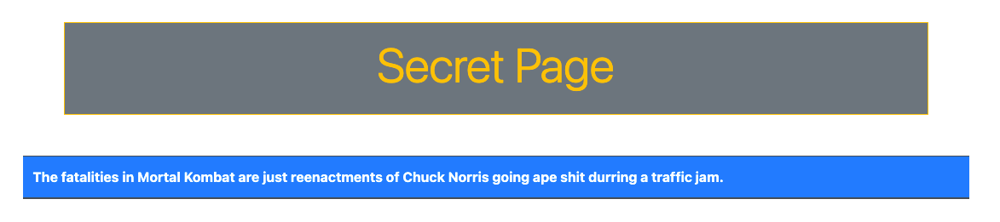
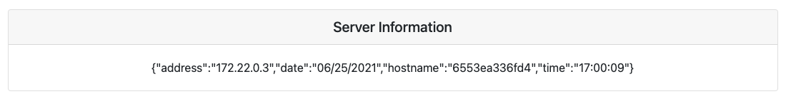
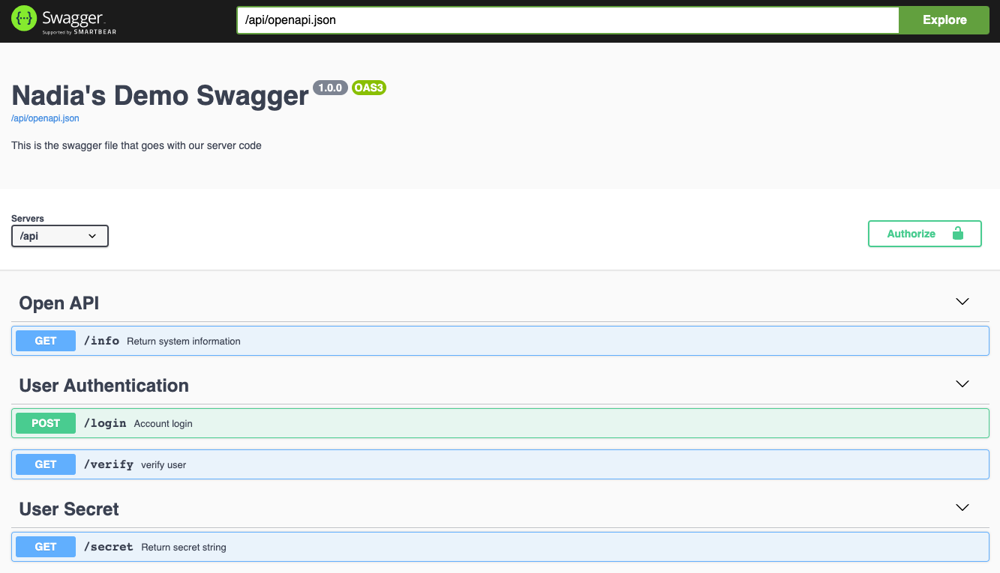

<!-- PROJECT SHIELDS -->
<!--
*** I'm using markdown "reference style" links for readability.
*** Reference links are enclosed in brackets [ ] instead of parentheses ( ).
*** See the bottom of this document for the declaration of the reference variables
*** for contributors-url, forks-url, etc. This is an optional, concise syntax you may use.
*** https://www.markdownguide.org/basic-syntax/#reference-style-links
-->

<!-- PROJECT LOGO -->
<br />
<p align="center">
  <h1 align="center">Nadia's Pigeonly Demo</h1>
</p>


<!-- TABLE OF CONTENTS -->
<details open="open">
  <summary><h2 style="display: inline-block">Table of Contents</h2></summary>
  <ol>
    <li>
      <a href="#about-the-project">About The Project</a>
      <ul>
        <li><a href="#built-with">Built With</a></li>
      </ul>
    </li>
    <li>
      <a href="#getting-started">Getting Started</a>
      <ul>
        <li><a href="#prerequisites">Prerequisites</a></li>
        <li><a href="#installation">Installation</a></li>
      </ul>
    </li>
    <li><a href="#usage">Usage</a></li>
    <li><a href="#contact">Contact</a></li>
  </ol>
</details>


<div id="about-the-project"></div>
<!-- ABOUT THE PROJECT -->

## About The Project



This project built using React, Flask, Connexion Swagger and Postgres stack. Backend Flask server demonstrates how front
end developers can use swagger documentations to build API calls. Since its build on top of Connexion framework that 
automagically handles HTTP requests based on OpenAPI Specification. It is using a simple frontend react app to create 
login page and uses jwt tokens to request and render protected user contents. JWT validations are handled but the backend 
server.

<div id="built-with"></div>

### Built With

* [Python]() - Coding language v3.8
* [Flask]() - The framework that allows interaction with data through http
* [Connexion]() - The framework that automagically handles HTTP requests based on OpenAPI Specification  
* [React]() - For building simple frontend app
* [Swagger]() - For API documentation 
* [SQLAlchemy]() - The ORM that interacts with python and the database
* [Docker]() - For Building environments
* [Postgres]() - A relations db for storing user credentials

<div id="getting-started"></div>
<!-- GETTING STARTED -->

## Getting Started

Clone the code and navigate to the code directory.
```sh
git clone https://github.com/NadiaSultana/pigeonly_demo.git
cd pigeonly_demo
```

<div id="prerequisites"></div>

### Prerequisites

Prerequisites for this project are `Docker` and `NPM`

<div id="installation"></div>

### Installation

#### server
```sh
docker-compose build
docker-compose up
```
#### Client
```sh
cd client
npm install
npm start
```
<!-- USAGE EXAMPLES -->
<div id="usage"></div>

## Usage

The use cases for the project are:
1. `Client` can log in from the UI http://localhost:3000/ with `--username=aa@aa.com` and `--password=aa`
   

   
   

2. `Client` can view their secret page when logged in. This will use a protected endpoint. ***User may need to `refresh`
the page.
   

   
   
3. `Client` when not logged in can view system info from landing page's `Systeminfo` button. 
   This will use a non-protected endpoint.
   

   
   
4. Using `Swagger` at http://localhost:5000/api/ui/ users can review the endpoints and play around with it.
   

   

5. User can use `Try it out` option in swagger to run the endpoints against the server.
   

   

<!-- CONTACT -->
<div id="contact"></div>

## Contact

[![LinkedIn][linkedin-shield]][linkedin-url]


<!-- MARKDOWN LINKS & IMAGES -->
[linkedin-shield]: https://img.shields.io/badge/-LinkedIn-black.svg?style=for-the-badge&logo=linkedin&colorB=555
[linkedin-url]: https://www.linkedin.com/in/nadia-sultana1/